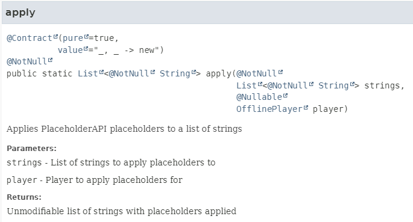
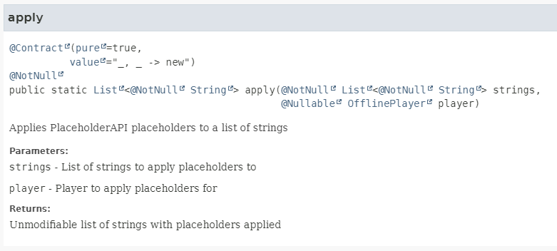

This is a gradle plugin to automatically remove doubled annotations caused by, for example, jetbrains annotations.

## Usage

The fix-javadoc-plugin is [available in the Gradle Plugin Portal](https://plugins.gradle.org/plugin/com.jeff-media.fix-javadoc-plugin).

```kotlin
plugins {
    id("com.jeff-media.fix-javadoc-plugin") version ("1.19")
}
```

The plugin will automatically generate a fix<taskName> for every task that extends Javadoc. The fix<taskName> task will
be executed after the respective Javadoc task.

## What does this do?

Imagine you have the following code, using jetbrains annotations (**not** annotations-java5):

```java
import org.jetbrains.annotations.NotNull;

public class PlaceholderAPIUtils {

    /**
     * Applies PlaceholderAPI placeholders to a list of strings
     *
     * @param strings List of strings to apply placeholders to
     * @param player  Player to apply placeholders for
     * @return Unmodifiable list of strings with placeholders applied
     */
    @Contract(pure = true, value = "_, _ -> new")
    @NotNull
    public static List<@NotNull String> apply(@NotNull List<@NotNull String> strings, @Nullable OfflinePlayer player) {
        // ...
    }
}
```

If you generate javadocs, the annotations appear twice in the output:


Using the plugin, the doubled annotations are removed from the javadoc output:



You can also optionally set `newLineOnMethodParameters` to false, if you don't want to have a newline between
annotations and method parameters:



## Configuration

```kotlin
tasks.withType<FixJavadoc>().configureEach {

    // Whether to keep a newline between annotation and method parameter (see screenshots above), default: true
    newLineOnMethodParameters.set(true)

    // Whether to keep the original, unfixed docs in a folder called "javadoc-original", default: false
    keepOriginal.set(false)
}
```
