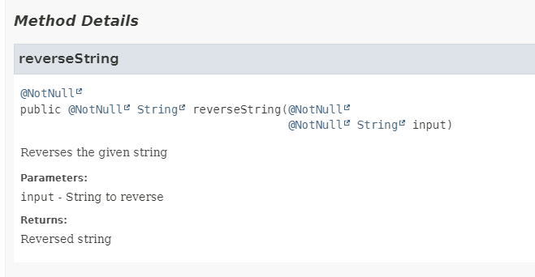
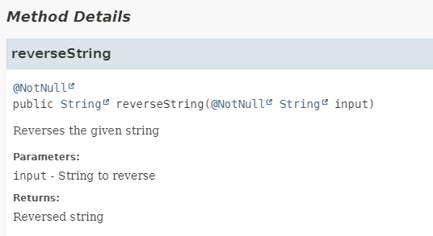

This is a gradle plugin to automatically remove doubled annotations caused by, for example, jetbrains annotations.

## What does this do?

Imagine you have the following code:

```java
import org.jetbrains.annotations.NotNull;

/**
 * Example class
 */
public class Example {

    /**
     * Reverses the given string
     * @param input String to reverse
     * @return Reversed string
     */
    @NotNull
    public String reverseString(@NotNull String input) {
        return new StringBuilder(input).reverse().toString();
    }
}
```

If you generate javadocs, the NotNull annotations appear twice in the output:



Using the plugin, the doubled annotations are removed from the javadoc output:

